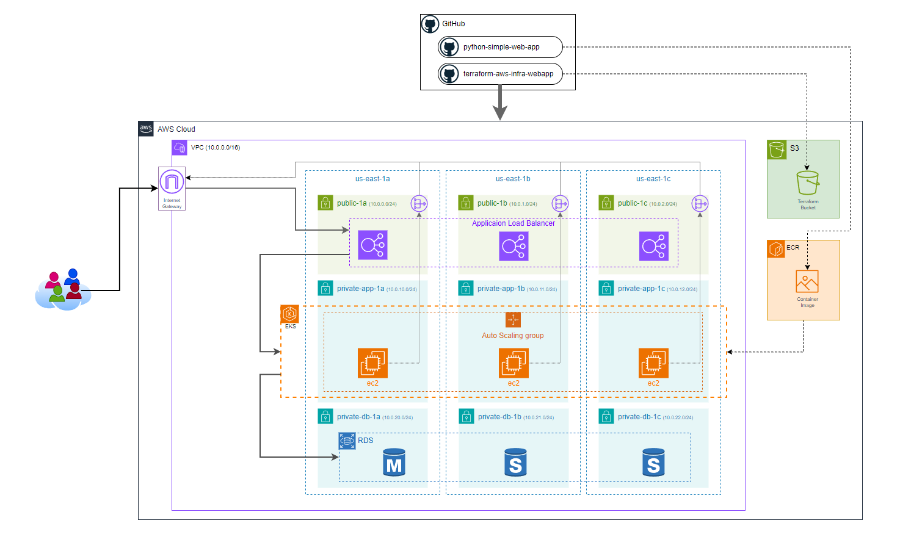

# terraform-aws-infra-webapp

## > IN PROGRESS <

Terraform project to deploy a complete infraestructure stack of 3-tier architecture (ALB + EKS + RDS) on AWS and GitHub Actions pipelines for Integration & Deployment (& Teardown).

This project will provide the infrastructure for the [python-simple-web-app](https://github.com/alissonpdc/python-simple-web-app) project (architecture diagram below).

## Introduction
### 3-tier architecture
To establish a robust and scalable IT infrastructure, Amazon Web Services (AWS) provides a reliable framework through its 3-tier architecture, consisting of Presentation, Application, and Data layers.
Each layer serves a specific purpose, contributing to a resilient and scalable system.

The Presentation layer, also known as the frontend, is responsible for interacting with users and providing a seamless interface.
In this layer, services like Elastic Load Balancing (ELB) from AWS can be employed to evenly distribute traffic among multiple instances, ensuring application availability and redundancy.
This guarantees a seamless user experience by efficiently managing requests and load balancing across resources in the Application layer.

The Application layer, hosted on Amazon Elastic Kubernetes Service (EKS), is where the core logic and functionality of the system reside.
EKS facilitates the orchestration and management of containers, enabling agile and scalable application deployment.
With EKS, developers can scale and update application logic independently, promoting flexibility and agility in development.

Finally, the Data layer utilizes Amazon Relational Database Service (RDS) to store and manage information reliably.
RDS provides managed relational databases, ensuring data integrity and availability.
By clearly separating the Presentation, Application, and Data layers, AWS's 3-tier architecture allows for the efficient construction of complex applications, offering a scalable and secure solution for organizations seeking high-performance IT infrastructure.

### Terraform
Terraform has become a crucial tool, fundamentally changing the way infrastructure is handled.
Essentially, Terraform is an open-source Infrastructure as Code (IaC) tool created by HashiCorp.
What makes Terraform unique is its capability to enable developers and operations teams to describe and manage infrastructure configurations through code.
This approach to setting up infrastructure not only removes manual errors and the possibility of human mistakes but also encourages teamwork, version control, and consistency across various cloud providers.

## Terraform Provisioning
### Root Module

### Additional Modules
#### Network

#### EKS
#### RDS

## GitHub Actions
### CI: Continuous Integration
### CD: Continuous Deployment
### Infrastructure Clean Up